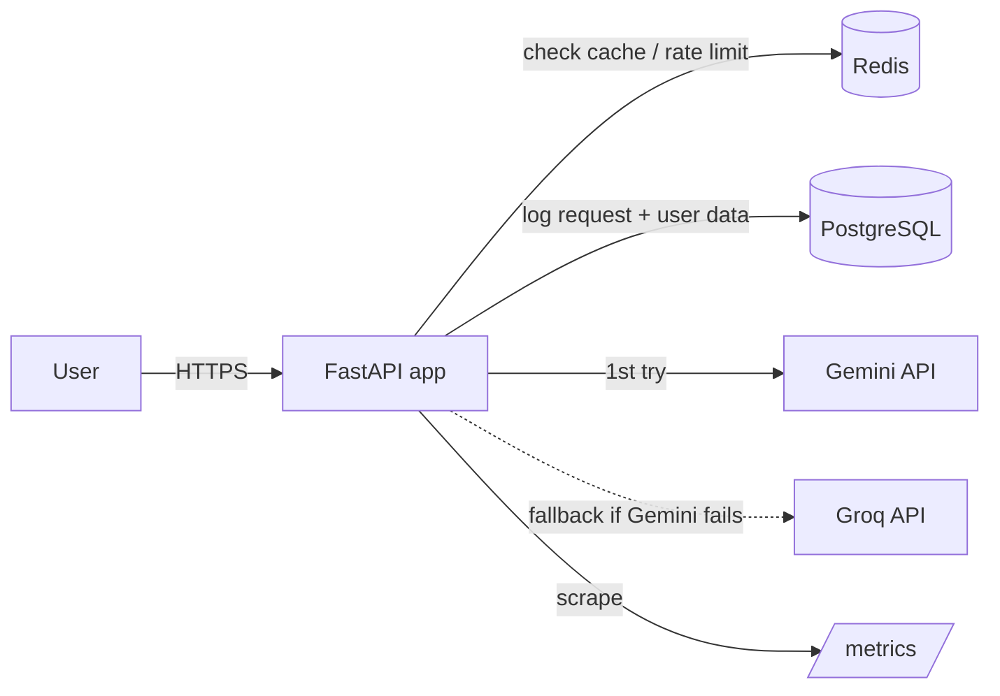
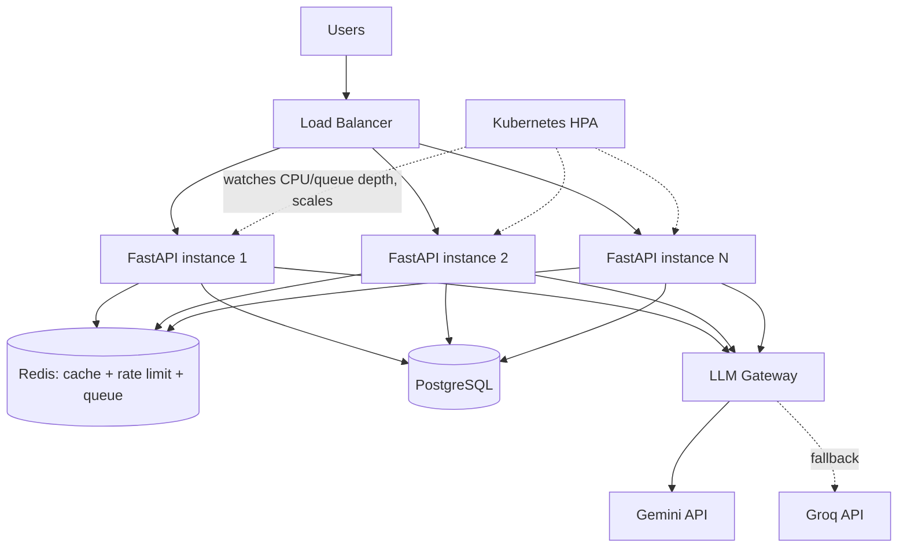

# Architecture

## Current build (what's actually running in this repo)

One FastAPI container, one Redis container, one Postgres container —
wired together by `docker-compose.yml`. This matches the scale the
assignment asks us to actually build (not simulate).

## Target production architecture (Section 4 — handling 100→500 req/s)

**Design decisions and why, point by point:**

- **Horizontal scaling (multiple FastAPI instances).** One process can
  only handle so many requests at once, especially since each `/chat`
  call sits waiting on a slow network call to an LLM. Running many
  identical copies behind a load balancer means the waiting is spread
  across many processes instead of queuing up behind one.

- **Load balancing.** The load balancer's job is to spread incoming
  requests evenly and to stop sending traffic to any instance whose
  `/health` check starts failing — exactly the health check this repo
  already implements.

- **Kubernetes HPA (Horizontal Pod Autoscaler).** Traffic here isn't
  constant — it's "100 req/s normally, spiking to 500." Instead of
  permanently paying for 5x capacity just in case, HPA watches a
  metric (CPU usage, or better, request queue depth) and adds pods
  automatically when load rises, then removes them again once it
  drops. This is the direct answer to "traffic occasionally increasing
  to 500 requests/second."

- **Redis for caching and distributed rate limiting.** Caching was
  covered above. The rate-limiting reason is specific to a
  multi-instance world: if each FastAPI instance counted requests in
  its own local memory, a user bounced between 5 different instances
  by the load balancer could send 5x the intended limit. Redis is
  shared by every instance, so the count is accurate no matter which
  instance handles which request.

- **Background queues for long-running work.** The assignment's core
  `/chat` flow is synchronous (ask → wait → get answer), which is fine
  for a single question. But if this were extended to, say, "summarize
  this 50-page document," that could take much longer than an HTTP
  client wants to wait. The production fix is to accept the job
  immediately, hand it to a queue (Redis-backed, e.g. via Celery or
  RQ), return a job ID right away, and let the client poll or get a
  webhook when it's done — a pattern this repo doesn't need for a
  single Q&A call today but the queue is drawn in the diagram because
  it's the correct extension point.

- **Rate limiting (protecting the app and the LLM provider).**
  Two-sided: it protects our own infrastructure from being overwhelmed,
  but just as importantly, it protects us from blowing through the
  LLM provider's own rate limit (see below) and getting every user
  blocked, not just the one sending too many requests.

- **LLM API limits (RPM, TPM, concurrency).** Every LLM provider caps
  how many requests per minute (RPM), tokens per minute (TPM), and
  concurrent in-flight requests an account can make. At 500 req/s, a
  single account will hit these caps in seconds. The realistic fix is
  a mix of: (a) our own rate limiter keeping us comfortably under the
  provider's ceiling, (b) the cache reducing how many requests reach
  the LLM at all for repeated questions, and (c) the fallback provider
  absorbing overflow when the primary is saturated — which is exactly
  what this repo's Gemini→Groq fallback already does at small scale.

- **Concurrent requests (many simultaneous LLM calls).** FastAPI's
  `async def` endpoints don't block a whole worker thread while
  waiting on the LLM's network response — the process can work on
  other requests during that wait. This is why `/chat` in this repo is
  `async` and uses `httpx.AsyncClient`, not the synchronous `requests`
  library.

- **Failure recovery (retries, timeouts, fallback, graceful
  degradation).** Implemented three ways in this repo:
  1. **Timeout** — every LLM call has a hard timeout
     (`LLM_TIMEOUT_SECONDS`) so one slow provider can't hang a request
     forever.
  2. **Retry with exponential backoff** — a transient failure (a
     dropped connection, a momentary 500) gets retried a couple of
     times with increasing waits (1s, 2s, ...) instead of failing
     instantly or hammering the provider.
  3. **Fallback + graceful degradation** — if Gemini is fully
     exhausted, Groq is tried. Only if *both* fail does the API return
     a clean `503 Service Unavailable` with a clear message, instead
     of a raw stack trace or a hung connection.

## Section 5 — Migrating a single EC2 server to 10,000 users

**Scenario recap:** one Python app on one EC2 instance, ~10 users
today, needs to support 10,000, and already gets slow/crashes
occasionally.

**Target end-state:** the same architecture diagrammed above — Load
Balancer → Kubernetes/ECS → FastAPI instances → Redis/Queue → LLM
Gateway → LLM APIs, with PostgreSQL as the persistent store.

**How I'd scale it:** move off "one server holds everything" onto the
horizontally-scaled version above, so capacity is added by running
more identical containers rather than by making one server bigger
(which always hits a ceiling).

**How I'd handle LLM API limits:** same as Section 4 — a rate limiter
in front of outbound LLM calls, a cache for repeated questions, and a
secondary provider as fallback so the whole app doesn't go down just
because one provider is rate-limiting us.

**How I'd handle slow/failing LLM requests:** the same timeout →
retry → fallback → clean error chain already built in `llm_client.py`,
so a hung LLM call degrades one request, not the whole server.

**Where Redis and queues fit:** Redis for the cache and the
rate-limit counters (both need to be shared across every instance,
which only a central store can do); a queue for any future
longer-running or bulk-processing workload so the API layer stays
fast and responsive.

**How retries/timeouts/fallbacks work:** exponential backoff per
provider, capped at a small number of attempts, then fallback to the
second provider, then a clean error — never an infinite retry loop
and never a bare crash.

**How I'd monitor it:** the `/metrics` endpoint exposes request
counts, latency, and token usage in Prometheus format; in production
this would be scraped by Prometheus and visualized in Grafana, with
alerts on rising error rate, rising p95 latency, or approaching the
LLM provider's rate limit.

**How I'd handle failures generally:** health checks remove unhealthy
instances from the load balancer automatically; the database and
cache each run as managed/replicated services rather than a single
point of failure; errors are caught and logged with enough context
(which provider, which user, how long it took) to debug after the
fact instead of just disappearing.

**How I'd migrate with minimal downtime:** stand up the new
containerized stack in parallel with the existing EC2 server, point a
small percentage of traffic at it via the load balancer, verify
behaviour matches, then gradually shift more traffic over (a
blue-green or canary rollout) and only decommission the old EC2
instance once the new stack has run cleanly under real traffic for a
while. This avoids a single "flip the switch and hope" cutover.

**How I'd manage secrets/configuration:** exactly as this repo already
does — every credential (JWT secret, LLM API keys, DB password) comes
from environment variables (`.env` locally, secret store / Kubernetes
Secrets in production), never hard-coded in the codebase, and
different environments (dev/staging/prod) just supply different
values for the same variable names.
